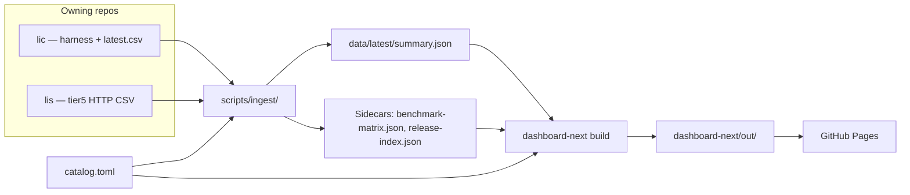

# Benchmark dashboard architecture

**Live:** https://li-langverse.github.io/benchmarks/  
**Implementation:** `dashboard-next/` (Next 15 static export, `basePath: /benchmarks`)

This document describes the data flow from catalog through ingest to GitHub Pages. For rules that must not regress, see [INVARIANTS.md](./INVARIANTS.md).

## End-to-end flow

## Catalog (`catalog.toml`)

- **Single source of benchmark ids** — one `[[benchmark]]` row per dashboard row (including size suffixes like `matmul_naive_N1024`).
- Fields drive ingest and UI: `category`, `pillar`, `package`, `tier`, `path`, `compare_oracle`, `threshold_ratio_cpp`, optional `problem_size` / `size_label` / `base_id`.
- `path = "unknown"` — algo_registry stub until a harness exists in **lic** (row still appears; status stays **unknown**).
- Sync helpers: `scripts/catalog/sync-from-algo-registry.py`, `scripts/catalog/enrich-catalog-metadata.py`.

## Ingest

| Script | Role |
|--------|------|
| `scripts/ingest/ingest-lic.sh` | Production path: build **lic** summary when available, else Python `build_summary.py` |
| `scripts/ingest/build_summary.py` | Merge **lic**/**lis** CSV + stability/security → `summary.json` |
| `scripts/ingest/build_summary_fixture.py` | CI/compare gate: full catalog from fixtures → `data/latest/summary.json` |
| `scripts/ingest/summary-compare-gate.sh` | Li vs Python parity on fixture catalog |
| `scripts/benchmark-matrix-report.py` | Markdown/JSON matrix from `summary.json` |

**Policy (ingest):** Li is never `sota_lang`; validity gate before perf colors; see [benchmark honesty](../honesty/benchmark-dashboard.md).

**Outputs under `data/latest/`:**

| File | Consumers |
|------|-----------|
| `summary.json` | Overview, `/matrix`, `/bench/[id]`, search, tier strip |
| `benchmark-matrix.json` | Matrix report, agent briefing |
| `release-index.json` | Package freshness (`/packages/[pkg]`) |

Proof corpus UI: **[proof-library](https://github.com/li-langverse/proof-library)** — `/proofs` redirects there.

## Dashboard-next

- **Build-time data:** `lib/summary.ts` reads `../data/latest/summary.json` at compile time (`loadSummary()`).
- **Runtime fetch (optional):** `/benchmarks/latest/summary.json` copied into `out/latest/` for client refresh without rebuild.
- **Static routes:** `generateStaticParams()` on `/bench/[id]` from summary rows; `/matrix`, `/pillar/[id]`, `/packages/[pkg]`.
- **Deploy:** `.github/workflows/pages.yml` on `main` when `dashboard-next/**` or `data/latest/**` changes.

## CI (regression gates)

| Job / step | Workflow | Checks |
|------------|----------|--------|
| `ingest-smoke` | `.github/workflows/ci.yml` | lic build, ingest, summary compare, tier-db stubs, **`dashboard-invariants`** |
| `dashboard-build` | same | `npm run build`, copy JSON to `out/latest/`, **`dashboard-static-routes`** |

Commands (local): documented in [INVARIANTS.md](./INVARIANTS.md).

## Related docs

- [INVARIANTS.md](./INVARIANTS.md) — must-not-break rules + verify commands
- [design-system.md](./design-system.md) — UI tokens and routes
- [diagram-layout.md](./diagram-layout.md) — Algorithm×Facet IA
- [coverage-gap-analysis.md](./coverage-gap-analysis.md) — measured vs pending harness
- [sitemap.md](./sitemap.md) — route quick reference
