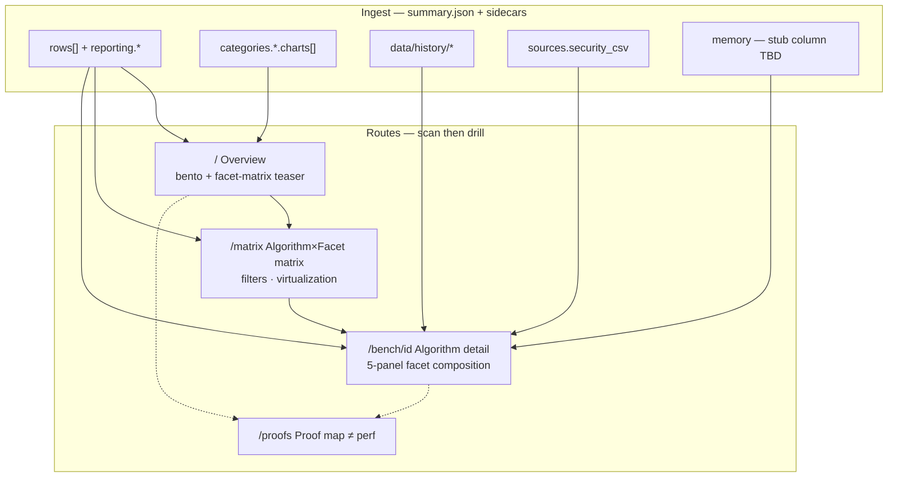
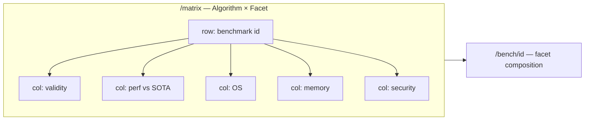
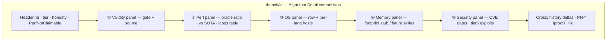

# Dashboard diagram layout — Algorithm × Facet IA

Compact information architecture for the Li benchmarks portal (`dashboard-next`). **One portal diagram** (two subgraphs), **one drill-down diagram** (single facet composition). Overview is an **Algorithm × Facet** matrix; detail is **one route** with five facet panels—not five top-level pages.

**Honesty constraints** (non-negotiable UI copy): Li is never SOTA; `validity_status` gates perf color/claims; `ratio_vs_sota` is informational vs best competitor (`sota_lang` ≠ `li`). See [benchmark-dashboard honesty](../honesty/benchmark-dashboard.md).

**Related:** [design-system.md](./design-system.md) · [sitemap.md](./sitemap.md)

---

## 1. Portal IA (primary diagram)

Two subgraphs only: **Routes** (what users navigate) and **Data** (what ingest feeds). Facet matrix lives on `/matrix` (extend existing table) and teasers on `/`.



| Route | Role in IA |
|-------|------------|
| `/` | Trust layer (honesty strip) + tier/pillar bento; **facet-matrix teaser** (top N rows, link → full matrix). |
| `/matrix` | Canonical **39 → 200+** scan surface: rows = algorithms, columns = five facets. |
| `/bench/[id]` | Single **Algorithm Detail** composition: validity → perf → OS → memory → security (one scroll, optional anchor nav). |
| `/proofs` | Cross-link only; never conflate G-* / Lean with facet perf colors. |

---

## 2. Overview wireframe — Algorithm × Facet matrix

Prefer a **heatmap matrix** over five separate overview pages. Row identity = `summary.rows[].benchmark` (catalog id). Column order is fixed so agents and humans build muscle memory.

### ASCII (desktop)

```
Honesty strip — measurements ≠ proofs; Li never SOTA; validity gates perf
┌──────────────────────────────────────────────────────────────────────────────┐
│ Filters: tier · category · pillar · validity · os · status · text search      │
├──────────────┬──────────┬─────────────┬──────┬─────────┬──────────────────────┤
│ Algorithm ▼  │ Validity │ Perf vs SOTA│  OS  │ Memory  │ Security             │
├──────────────┼──────────┼─────────────┼──────┼─────────┼──────────────────────┤
│ horner_pure… │ pass ●   │ 1.12 / rust │ lin  │ — stub  │ CVE row green        │
│ matmul_blk   │ unknown ?│ — gated     │ unk  │ —       │ n/a                  │
│ static_large │ fail ●   │ not claimable│ dar │ peak —  │ tier5 matrix link   │
│ … (virtual)  │          │             │      │         │                      │
└──────────────┴──────────┴─────────────┴──────┴─────────┴──────────────────────┘
                              click row → /bench/{id}  (all facets on one page)
```

### Mermaid (layout structure)



**Cell encoding (overview):**

| Column | Cell content (compact) | Color source |
|--------|------------------------|--------------|
| Validity | `pass` / `fail` / `unknown` + optional `validity_source` tooltip | Badge hue; fail forces perf column “not claimable” |
| Perf vs SOTA | `ratio_vs_sota` mono + `sota_lang`; secondary `ratio_vs_cpp` vs oracle | `status` **only if** `validity_status === pass`; else muted + strikethrough |
| OS | `row.os` or multi-OS chip from `langs[].os` | Neutral; filter via `reporting.os_values` |
| Memory | `peak_rss_mb` or `—` | Neutral until ingest exists |
| Security | Gate pass/fail or link to security chart / exploit row | From security ingest, not bench `status` |

**Bento alternative on `/`:** five **horizontal facet strips** (aggregate counts per facet) above the matrix teaser—same columns, collapsed to sparkline + counts. Do not duplicate full matrix on home.

---

## 3. Drill-down — one Algorithm Detail composition

Single route `/bench/[id]`; five **facets** as panels in one vertical composition (not `/bench/id/validity`, etc.). Optional sticky **facet rail** (anchor links) for keyboard users.



**Radial variant (optional WP2 polish):** same five nodes in a pentagon with center = `benchmark` id; use only on wide viewports (`min-width: 1280px`). Mobile always uses stacked panels above.

| Facet | Panel (existing / planned) | Primary question |
|-------|---------------------------|------------------|
| Validity | `ValidityPanel`, `ValidityBadge`, `PerfNotClaimable` | Is perf claimable? |
| Perf | `LangsTable`, ratio dl, `Badge status` | How fast vs oracle and vs best competitor? |
| OS | `OsTable` | Where was it measured? |
| Memory | `MemoryFacet` (stub) | What is peak / steady footprint? |
| Security | Security chart slice + `benchmark-matrix` exploit row when applicable | Do security gates pass? |

---

## 4. JSON field mapping

### Summary row (`summary.rows[]`) — matrix row driver

| Facet | JSON fields | Notes |
|-------|-------------|-------|
| **Validity** | `validity_status`, `validity_source` | `fail` / `unknown` → perf not claimable in UI |
| **Performance** | `status`, `ratio_vs_cpp`, `ratio_vs_sota`, `sota_lang`, `sota_value`, `li_value`, `cpp_value`, `compare_oracle`, `threshold_ratio_cpp`, `metric`, `unit`, `variant` | `status` computed after validity gate in ingest |
| **OS** | `os`, `langs[].os` | Distinct set also in `reporting.os_values` |
| **Memory** | *(planned)* `peak_rss_mb`, `memory_bytes`, or `categories.*.charts[].metric === "peak_rss"` | **Stub:** show `—` until CSV + ingest; do not invent ratios |
| **Security** | Row-level when `category === "security"` or benchmark id `security_gates`; else link | Aggregate chart from `sources.security_csv` |

### Chart series (`categories.*.charts[]`, `pillars.*.charts[]`)

| Facet | JSON fields | Notes |
|-------|-------------|-------|
| Validity | `validity_status`, `validity_source` | Mirrors row gate on chart cards |
| Performance | `status`, `ratio_vs_reference`, `ratio_vs_sota`, `sota_lang`, `series[]` | `series[]`: `{ lang, value, unit, passed?, os? }` |
| OS | `os`, `series[].os` | Per-language breakdown on detail |
| Memory | *TBD* in `series[]` | Align with `schema/bench-result.json` extension |
| Security | `categories.security.charts[]` from `build_security_chart()` | `id: security_gates`, `metric`, `series` |

### Reporting meta (`summary.reporting`)

| Field | Facet use |
|-------|-----------|
| `sota_policy` | Honesty strip copy on matrix + detail |
| `validity_required_default` | Tooltip when `validity_status === unknown` |
| `os_values` | Matrix OS column filter chips |

### Sources (`summary.sources`)

| Key | Facet |
|-----|-------|
| `lic_csv` / `lis_csv` | Perf + OS + validity (`passed`) |
| `stability_csv` | Validity |
| `security_csv` | Security facet / category block |

### Sidecars (not in every row)

| File | Facet |
|------|-------|
| `data/latest/benchmark-matrix.json` | Security HTTP exploit matrix; catalog metadata |
| `data/history/index.json` | Perf facet trend on detail |
Proof corpus: external [proof-library](https://li-langverse.github.io/proof-library/) via `/proofs` redirect.

---

## 5. UX — 39 rows today, 200+ catalog tomorrow

### At ~39 rows (current)

- Full matrix fits without virtualization; enable **sticky header** + **sticky first column** (algorithm id).
- Default sort: `status` severity (red → unknown → yellow → green) then `benchmark` id.
- Show **sparse honesty**: every row displays validity + perf columns even when unknown—never hide empty cells.
- Facet **sparklines** optional in perf column when `data/history` has ≥2 points for that id.

### At 200+ rows

- **Virtualized table** (`@tanstack/react-virtual` or equivalent): row height ~32px, only visible rows in DOM.
- **Column virtualization not required** (5 facet columns fixed).
- Server/build remains static: filter client-side on prebuilt `summary.json`; debounce search 150ms.
- **Facet sparklines** in perf column: 24px wide SVG from history series; `aria-label` with last ratio.
- Export: “Copy CSV slice” for filtered rows (agent preflight).
- Collapse bento on `/` to counts-only; matrix is the heavy view.

### Interaction rules

1. Click **row** (not individual cell) → `/bench/[id]` with all facets.
2. Cell tooltips cite **field names** (`ratio_vs_sota`, `validity_source`) for agent debugging.
3. Security column: if no row-level security data, show “catalog” or “gates” link to `categories.security` chart.
4. Memory column: uniform `— (planned)` until ingest lands—no fake green.

---

## 6. Implementation plan (dashboard-next)

| Piece | Path | Status |
|-------|------|--------|
| Facet types + grid props | `dashboard-next/components/bench/algorithm-facet-grid.tsx` | Types stub |
| Matrix columns | Extend `matrix-catalog-table.tsx` or new `facet-matrix-table.tsx` | WP2 |
| Detail composition | Reorder `app/bench/[id]/page.tsx` panels to facet order ①–⑤ | WP2 |
| Memory ingest | `build_summary.py` + `bench-result.json` | Blocked on CSV producer |

---

## Agent continuation

1. **Read:** this file, [design-system.md](./design-system.md), [benchmark-dashboard honesty](../honesty/benchmark-dashboard.md), `dashboard-next/lib/summary.ts`.
2. **Run:** `cd dashboard-next && npm run build` after implementing facet matrix columns.
3. **Next:** WP2 — virtualized facet matrix on `/matrix`; wire `algorithm-facet-grid` types to table cells; add memory fields to ingest when lic exports RSS.
4. **Blocked:** Memory facet ratios until CSV column exists; do not label Li SOTA when wiring cells.
