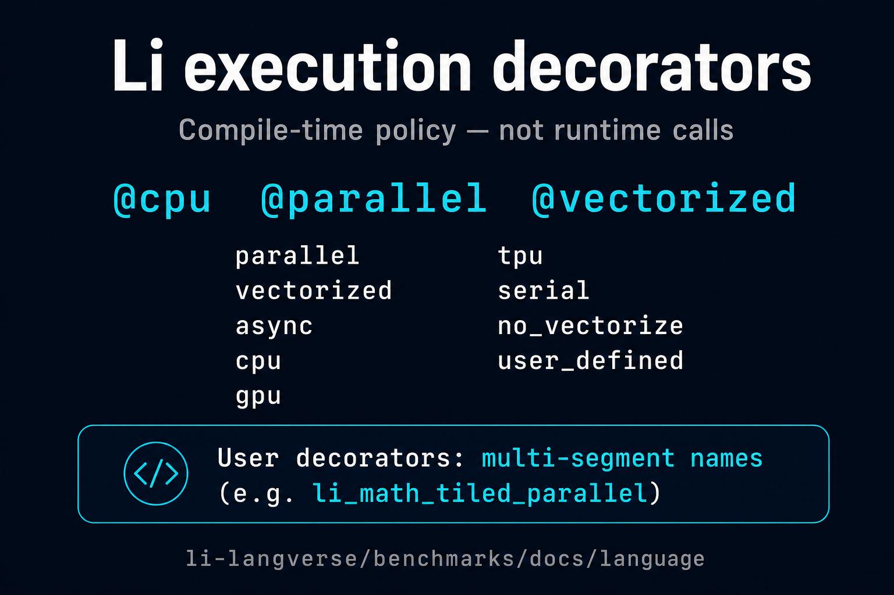

# Execution decorators in Li (intro)

**Source of truth:** [`lic` `std/execution/decorators.li`](https://github.com/li-langverse/lic/blob/main/std/execution/decorators.li) (Phase 7d-d).

Users attach **compile-time execution decorators** to `def` / loops:

```li
@cpu
@parallel(disjoint = disjointElem)
@vectorized
def hotLoop(xs: ptr, n: int64) -> unit
  requires n >= 0
=
  # ...
  return
```

## What makes them “execution” decorators?

- They are **elaborated at compile time** — **not** ordinary runtime calls.
- They participate in the **parallel / vector / device** policy story (`PH-7e`, **G-par**): see ecosystem notes on Kokkos-class lowering vs LLVM / OpenMP.

## Reserved names (cannot be a user-defined single-segment decorator)

From `decorators.li` commentary:

`parallel`, `vectorized`, `async`, `cpu`, `gpu`, `tpu`, `user_defined`, `serial`, `no_vectorize`

**User-defined** decorators that are not in this reserved set should use **multi-segment names**, e.g. `li_math_tiled_parallel`, to avoid collisions with the execution policy namespace.

## Mental model (one line each)

| Decorator | Plain-language intent |
|-----------|------------------------|
| `@cpu` | Prefer host CPU execution policy for this region |
| `@parallel(...)` | Structured parallelism with disjointness / scheduling hints |
| `@vectorized` | SIMD / autovec-friendly loop body |
| `@serial` | Intentionally sequential (opt out of parallel rewrite) |
| `@no_vectorize` | Prevent vectorizer from changing numerics layout |

Exact parameters and lowering are **`lic` implementation details** — watch [`lic#15`](https://github.com/li-langverse/lic/issues/15) and related **G-par** issues for codegen status.

---

## Shareable one-pager


