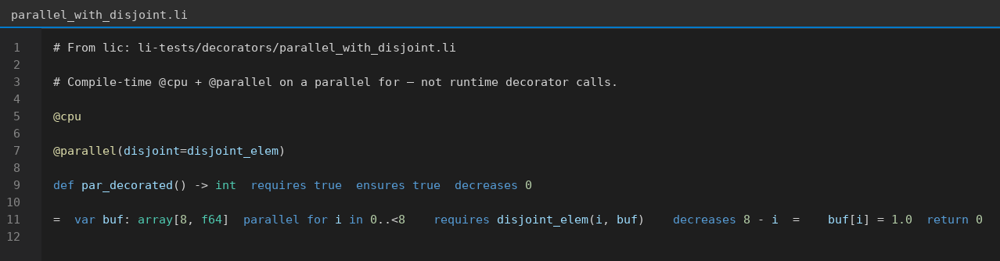

# Execution decorators in Li (intro)

**Source of truth:** [`lic` `std/execution/decorators.li`](https://github.com/li-langverse/lic/blob/main/std/execution/decorators.li) and [`li-tests/decorators/parallel_with_disjoint.li`](https://github.com/li-langverse/lic/blob/main/li-tests/decorators/parallel_with_disjoint.li).

Execution decorators attach to **`def`** or loops and are **elaborated at compile time** — they are **not** runtime calls.

## Real code: `@cpu` + `@parallel` on a parallel loop

Vendored copy: [`examples/parallel_with_disjoint.li`](examples/parallel_with_disjoint.li)

```li
@cpu
@parallel(disjoint=disjoint_elem)
def par_decorated() -> int
  requires true
  ensures true
  decreases 0
=
  var buf: array[8, f64]
  parallel for i in 0..<8
    requires disjoint_elem(i, buf)
    decreases 8 - i
  =
    buf[i] = 1.0
  return 0
```

`disjoint_elem` documents that iterations do not race on `buf` — ties into **G-par** / race checks in `lic`.

## Reserved single-segment names

`parallel`, `vectorized`, `async`, `cpu`, `gpu`, `tpu`, `user_defined`, `serial`, `no_vectorize`

User decorators outside this set should use **multi-segment** names (e.g. `li_math_tiled_parallel`).

Lowering status: [`lic#15`](https://github.com/li-langverse/lic/issues/15) (Kokkos-class / LLVM OpenMP path).

---

## Shareable (editor screenshot)

Regenerate: `python3 scripts/render-li-code-image.py --all`


