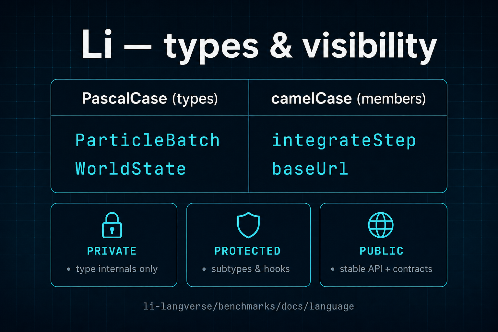

# Types, classes, and naming (Li style)

## PascalCase vs camelCase (what we mean by “camel case for classes”)

In Li ecosystem docs we follow the usual split:

| Surface | Convention | Examples |
|---------|--------------|----------|
| **Types / classes / traits** | **PascalCase** (upper camel case) | `ParticleBatch`, `HttpClient`, `WorldState` |
| **Methods, functions, locals, fields** | **camelCase** (lower camel case) | `integrateStep`, `baseUrl`, `rowCount` |
| **Modules** | short lowercase segments | `io`, `csv`, `summary` (see benchmarks PH-IO samples) |
| **Constants** (when you need global clarity) | `SCREAMING_SNAKE_CASE` | `MAX_BODY_BYTES` |

**Rationale:** PascalCase type names read as “nouns / capsules”; camelCase operations read as “verbs or properties”. That matches tooling (IDE outline), generated FFI, and proof text that refers to types by name.

---

## Class sketch: visibility and encapsulation (design draft)

The snippet below is an **illustrative** object-oriented surface aligned with Li’s **`def`**, contracts, and `raises` style. **Parser and keyword spellings may differ** until the feature lands in `lic` (e.g. `pub` vs `public`); treat this as the **target ergonomics** for docs and teaching.

```li
# Illustrative — verify against lic before relying on compiler support

public class ParticleBatch
  private var count: int = 0
  protected var capacity: int = 64

  # Visible API — stable for callers and proofs
  public def size(self) -> int
    requires true
    ensures result >= 0
  =
    return self.count

  public def push(self, x: float) raises IoError, AllocError -> unit
    requires self.count >= 0
  =
    self.ensureCapacity(self.count + 1)
    # ... write x at self.count ...
    self.count = self.count + 1

  # Implementation detail — not part of public spec
  private def ensureCapacity(self, minCap: int) raises AllocError -> unit
    requires minCap >= 0
  =
    if minCap <= self.capacity:
      return
    # ... reallocate ...
    self.capacity = minCap

  # Subtype / fixture hooks — narrower than public, wider than private
  protected def onResize(self, newCap: int) -> unit
    requires newCap >= 0
  =
    return
```

### Modifier cheat sheet (intent)

| Modifier | Who can use it | Typical use |
|----------|----------------|--------------|
| **private** | Only this type | Invariants, allocation, internal buffers |
| **protected** | This type + subclasses / same module family | Extension hooks, test doubles |
| **public** | Any importer | Stable API surface, documented contracts |

**Proof note:** contracts on **public** and **protected** methods are the usual audit surface; **private** helpers can stay underspecified only when proofs compose through public lemmas (see [`provability-gaps`](https://github.com/li-langverse/lic/blob/main/docs/verification/provability-gaps.md) — do not overclaim).

---

## Shareable one-pager


